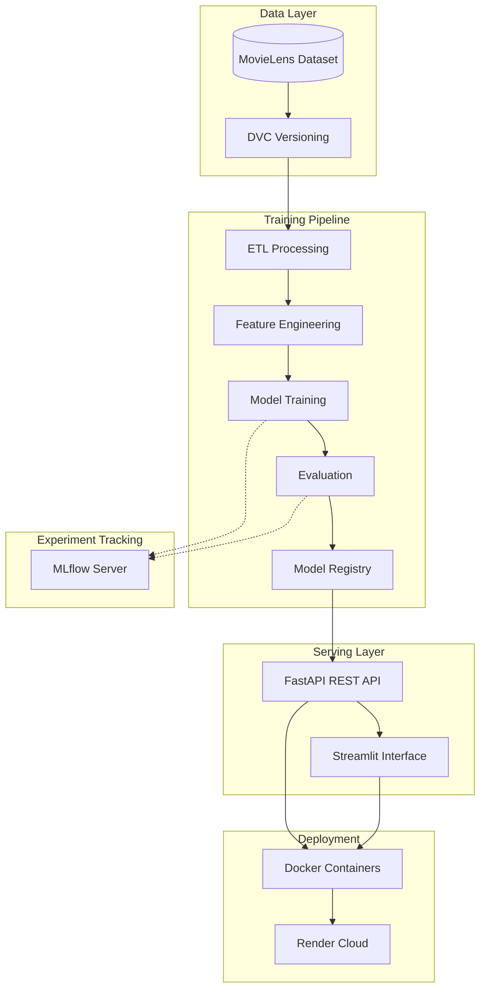
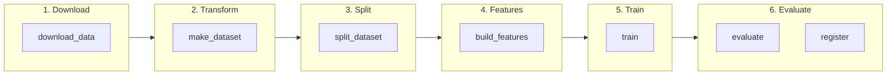
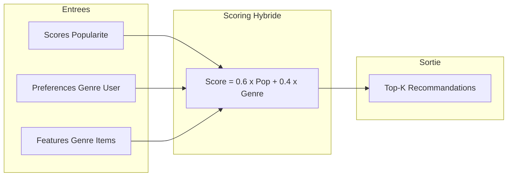

# Système de Recommandation de Films

> Découvrez vos prochains films préférés grâce à l'intelligence artificielle

[](https://mlops-recommender-ui.onrender.com)
[](https://mlops-recommender-system-1.onrender.com/docs)
[](https://python.org)
[](https://mlflow.org)
[](https://dvc.org)

---

## Présentation

Ce projet est un **moteur de recommandation de films** intelligent qui analyse les goûts des utilisateurs pour suggérer des films personnalisés.

Comparable aux systèmes utilisés par Netflix ou Amazon : le système apprend des préférences utilisateurs et recommande des contenus similaires.

### Cas d'usage

| Scénario | Fonctionnement |
|----------|----------------|
| Utilisateur a aimé "Inception" | Recommande des thrillers sci-fi similaires |
| Nouvel utilisateur | Propose les films les plus populaires |
| Exploration | "Les gens qui ont aimé ce film ont aussi aimé..." |

---

## Architecture Système



---

## Pipeline MLOps

Le projet utilise **DVC** pour orchestrer un pipeline reproductible en 6 étapes :



### Détail des étapes

| Étape | Module | Entrées | Sorties | Description |
|-------|--------|---------|---------|-------------|
| **download_data** | `src.data.download_data` | URL Kaggle | `data/raw/` | Téléchargement MovieLens depuis Kaggle |
| **make_dataset** | `src.data.make_dataset` | Fichiers bruts | `interactions.parquet`, `movies.parquet` | Nettoyage et transformation des données |
| **split_dataset** | `src.data.split_dataset` | Interactions | Train/Val/Test + Encoders | Split temporel avec encodage utilisateurs/items |
| **build_features** | `src.features.build_features` | Splits | Matrices sparses + Popularité | Construction des matrices d'interaction CSR |
| **train** | `src.models.train` | Matrices | `model.joblib` | Entraînement du modèle (Popularity/ALS) |
| **evaluate** | `src.models.evaluate` | Modèle + Test | Métriques JSON | Évaluation Precision@K, Recall@K, NDCG, MRR |
| **register** | `src.models.register` | Modèle + Métriques | Model Registry | Enregistrement du modèle en Production |

### Exécution du pipeline

```bash
# Pipeline complet
dvc repro

# Étape spécifique
dvc repro train

# Visualiser le DAG
dvc dag
```

---

## Modèles de Recommandation

### Popularity Baseline avec Personnalisation Hybride

Le modèle principal combine **popularité globale** et **préférences utilisateur par genre** :



**Avantages :**
- Cold-start résolu par la popularité
- Personnalisation via les genres préférés de l'utilisateur
- Pas de latence de calcul (scores pré-calculés)

### ALS (Alternating Least Squares)

Modèle de **factorisation matricielle** pour feedback implicite :

| Paramètre | Valeur | Description |
|-----------|--------|-------------|
| `factors` | 64 | Dimension des embeddings |
| `regularization` | 0.01 | Régularisation L2 |
| `iterations` | 15 | Itérations d'optimisation |
| `alpha` | 40.0 | Confiance pour feedback implicite |

---

## Métriques d'Évaluation

| Métrique | Valeur | Description |
|----------|--------|-------------|
| **Precision@5** | 0.133 | Proportion de recommandations pertinentes |
| **Recall@5** | 0.037 | Proportion d'items pertinents retrouvés |
| **NDCG@5** | 0.146 | Qualité du ranking (gain cumulé) |
| **MRR** | 0.213 | Rang moyen de la première recommandation pertinente |

---

## Stack Technique

| Domaine | Technologies |
|---------|-------------|
| **Data Processing** | Pandas, NumPy, SciPy (sparse matrices) |
| **ML/Recommandation** | Implicit (ALS), Scikit-learn |
| **Tracking** | MLflow, DVC |
| **API** | FastAPI, Pydantic, Uvicorn |
| **Frontend** | Streamlit |
| **Containerisation** | Docker, Docker Compose |
| **CI/CD** | GitHub Actions |
| **Cloud** | Render |

---

## Données

Jeu de données **MovieLens Small** :

| Statistique | Valeur |
|-------------|--------|
| Évaluations | ~100,000 |
| Utilisateurs | ~600 |
| Films | ~10,000 |
| Densité | ~1.7% |

---

## Structure du Projet

```
mlops-recommender-system/
├── src/
│   ├── data/                 # ETL : download, make_dataset, split
│   ├── features/             # Feature engineering
│   ├── models/               # Train, evaluate, recommend, register
│   │   ├── train.py          # Entraînement avec Optuna
│   │   ├── evaluate.py       # Métriques ranking
│   │   ├── recommend.py      # Classe Recommender
│   │   └── model_classes.py  # PopularityModel, ALSModel
│   ├── serving/              # API FastAPI
│   │   └── api.py            # Endpoints REST
│   ├── ui/                   # Interface Streamlit
│   │   └── app.py            # Application web
│   └── utils/                # Utilitaires (logging, I/O)
├── configs/                  # Configuration YAML (Hydra)
├── data/
│   ├── raw/                  # Données brutes (gitignored)
│   ├── interim/              # Données intermédiaires
│   └── processed/            # Features prêtes pour le modèle
├── models/                   # Modèles entraînés (.joblib)
├── docker/                   # Dockerfiles (API, UI, Train)
├── tests/                    # Tests unitaires pytest
├── dvc.yaml                  # Pipeline DVC
├── params.yaml               # Hyperparamètres
├── compose.yaml              # Docker Compose local
├── Dockerfile                # Image API (Render)
├── Dockerfile.ui             # Image UI (Render)
└── render.yaml               # Configuration Render
```

---

## Installation locale

```bash
# Cloner le projet
git clone https://github.com/Souley225/mlops-recommender-system.git
cd mlops-recommender-system

# Installation des dépendances
pip install poetry
poetry install

# Exécuter le pipeline complet
dvc repro

# Lancer l'API
poetry run uvicorn src.serving.api:app --host 0.0.0.0 --port 8000

# Lancer l'interface (autre terminal)
poetry run streamlit run src/ui/app.py
```

### Docker Compose

```bash
# Démarrer tous les services
docker compose up -d

# Services disponibles :
# - API      : http://localhost:8000
# - UI       : http://localhost:8501
# - MLflow   : http://localhost:5000
```

---

## API Endpoints

| Méthode | Endpoint | Description |
|---------|----------|-------------|
| `GET` | `/health` | Health check |
| `GET` | `/users` | Liste des utilisateurs |
| `GET` | `/recommend/{user_id}` | Recommandations personnalisées |
| `GET` | `/similar/{movie_id}` | Films similaires |
| `GET` | `/movies/{movie_id}` | Détails d'un film |

Documentation Swagger : [/docs](https://mlops-recommender-system-1.onrender.com/docs)

---

## Contact

**Souleymane SALL** - Data Scientist / ML Engineer

[](https://github.com/Souley225)
[](https://linkedin.com/in/souleymanes-sall)

---

## Licence

MIT
